# Snake Race — ARSW Lab #2 (Java 21, Virtual Threads)

**Escuela Colombiana de Ingeniería – Arquitecturas de Software**  
Laboratorio de programación concurrente: condiciones de carrera, sincronización y colecciones seguras.

Nombres : Marco Alvarez - Andres Sabogal

---

# Actividades del laboratorio

## Parte I — (Calentamiento) `wait/notify` en un programa multi-hilo

1. Toma el programa [**PrimeFinder**](https://github.com/ARSW-ECI/wait-notify-excercise).

R/ Cabe acalarar que el programa esta en la carpeta de "[wait-notify-excercise-master](wait-notify-excercise-master)"

2. Modifícalo para que **cada _t_ milisegundos**:
    - Se **pausen** todos los hilos trabajadores.
    - Se **muestre** cuántos números primos se han encontrado.
    - El programa **espere ENTER** para **reanudar**.

R/ Aqui esta una muestra de como se muestra en consola
  - 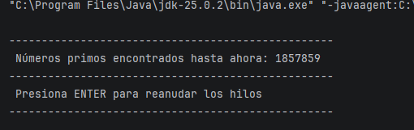
  - 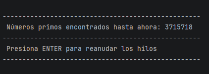

3. La sincronización debe usar **`synchronized`**, **`wait()`**, **`notify()` / `notifyAll()`** sobre el **mismo monitor** (sin _busy-waiting_).
    
    - Synchronized y wait

    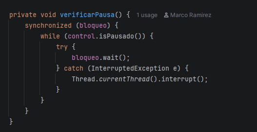

   - notifyall
    
    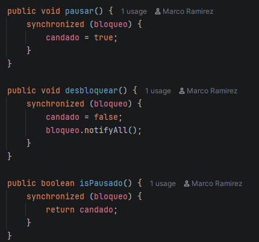


4. Entrega en el reporte de laboratorio **las observaciones y/o comentarios** explicando tu diseño de sincronización (qué lock, qué condición, cómo evitas _lost wakeups_).

R/ Para este caso utilizamos un monitor basado en un bloqueo (bloqueo) explicito con un objeto compartido y una variable condicional (candado).
Este diseño evita los "Lost wakeups" mediante notificacion explicita (desbloquear) el cual ejecuta un (notifyAll) ademas de utilizar del uso de un while y una condicion de bloqueo antes del (wait)

> Objetivo didáctico: practicar suspensión/continuación **sin** espera activa y consolidar el modelo de monitores en Java.

---
## Parte II — SnakeRace concurrente (núcleo del laboratorio)
---
## Requisitos

- **JDK 21** (Temurin recomendado)
- **Maven 3.9+**
- SO: Windows, macOS o Linux

---

## Cómo ejecutar

```bash
mvn clean verify
mvn -q -DskipTests exec:java -Dsnakes=4
```

- `-Dsnakes=N` → inicia el juego con **N** serpientes (por defecto 2).
- **Controles**:
  - **Flechas**: serpiente **0** (Jugador 1).
  - **WASD**: serpiente **1** (si existe).
  - **Espacio** o botón **Action**: Pausar / Reanudar.

---

## Reglas del juego (resumen)

- **N serpientes** corren de forma autónoma (cada una en su propio hilo).
- **Ratones**: al comer uno, la serpiente **crece** y aparece un **nuevo obstáculo**.
- **Obstáculos**: si la cabeza entra en un obstáculo hay **rebote**.
- **Teletransportadores** (flechas rojas): entrar por uno te **saca por su par**.
- **Rayos (Turbo)**: al pisarlos, la serpiente obtiene **velocidad aumentada** temporal.
- Movimiento con **wrap-around** (el tablero “se repite” en los bordes).

---

## Arquitectura (carpetas)

```
co.eci.snake
├─ app/                 # Bootstrap de la aplicación (Main)
├─ core/                # Dominio: Board, Snake, Direction, Position
├─ core/engine/         # GameClock (ticks, Pausa/Reanudar)
├─ concurrency/         # SnakeRunner (lógica por serpiente con virtual threads)
└─ ui/legacy/           # UI estilo legado (Swing) con grilla y botón Action
```
### 1) Análisis de concurrencia

  - Explica **cómo** el código usa hilos para dar autonomía a cada serpiente.

  R/La autonomia de las serpientes se logra mediante la interfaz "Runnable" en la clase SnakeRunner, cada intancia encapsula a una serpinete
    y al tablarero ejecutando un bucle independiente dentro de su propio hilo. 

  -**Identifica** y documenta en **`el reporte de laboratorio`**:

  - Posibles **condiciones de carrera**.

  R/ Una posible condición carrera es la posicion de las serpientes, ya que estas deben estarse registrando al mismo tiempo para evitar coliciones entre las mismas,
    además existe la posibilidad de que las serpientes se salgan del tablero.

  - **Colecciones** o estructuras **no seguras** en contexto concurrente.

  R/ - Hashset
     - Hasmap
    ya que si se añaden o remueven elementos fuera de secciones sincronizadas en métodos no mostrados, se producirán excepciones o corrupción de datos.

  - Ocurrencias de **espera activa** (busy-wait) o de sincronización innecesaria.

  R/ El metodo MoveResult bloquea toda la instancia de Board cada vez que cualquier serpiente intenta dar un paso.
  Si hay múltiples serpientes, los hilos se encadenan esperando por el mismo cerrojo.

  Los getters como mice(), obstacles(), turbo() y teleports() crean nuevas copias de las colecciones dentro de bloques synchronized. Copiar estructuras completas bajo un lock genera sobrecarga y detiene a otros hilos ejecutando step().


### 2) Correcciones mínimas y regiones críticas

- **Elimina** esperas activas reemplazándolas por **señales** / **estados** o mecanismos de la librería de concurrencia.

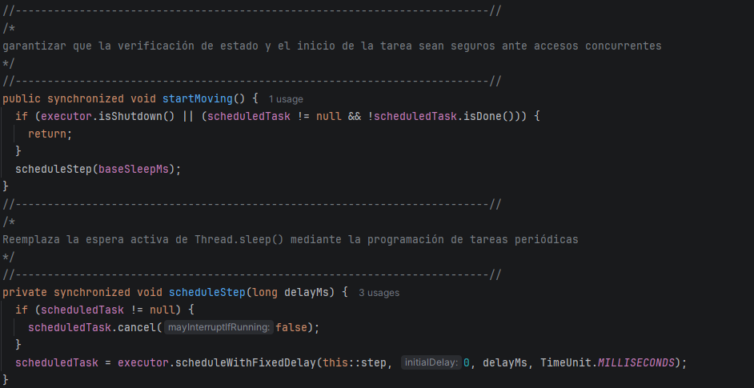
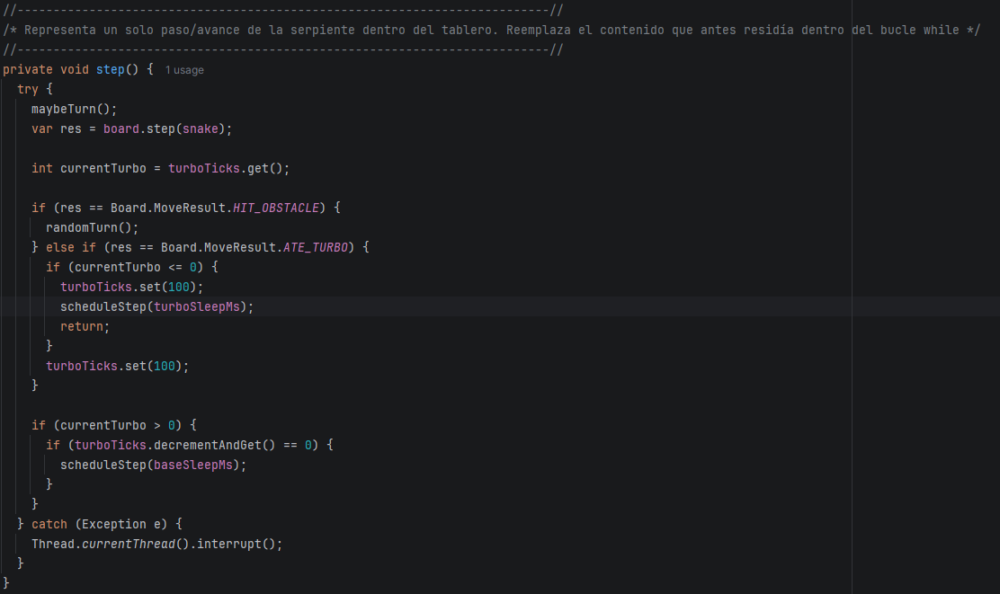

- Protege **solo** las **regiones críticas estrictamente necesarias** (evita bloqueos amplios).

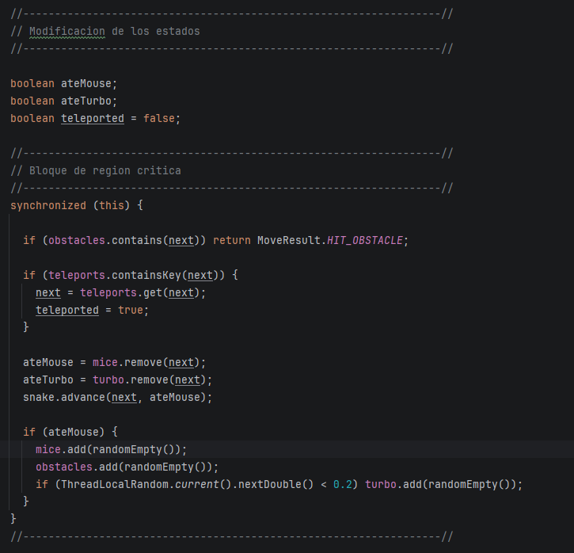

- Justifica en **`el reporte de laboratorio`** cada cambio: cuál era el riesgo y cómo lo resuelves.

R/ Eliminación de espera activa (Thread.sleep)

-Riesgo previo: El uso de Thread.sleep() dentro de un bucle while bloquea el hilo de ejecución durante el tiempo de espera. 
Esto genera una espera activa (busy-waiting) que consume recursos del sistema de forma ineficiente, degrada la capacidad de respuesta ante interrupciones externas.

-Solución: Se reemplaza el bucle y la suspensión manual por la programación periódica de tareas mediante ScheduledExecutorService con scheduleWithFixedDelay(). 
El framework de concurrencia gestiona los tiempos de ejecución mediante temporizadores del sistema operativo, liberando el hilo cuando no hay trabajo activo que realizar.

-Riesgo previo (Condición de Carrera y Estado Inconsistente): Interferencia mutua al evaluar y modificar celdas: 
Si dos serpientes intentan moverse a la misma posición al mismo tiempo, ambas podrían leer que el ratón existe y ejecutar mice.remove(next) con éxito. Esto provocaría que ambas creyeran haber comido el ratón, duplicando la puntuación, creciendo ambas e insertando múltiples elementos nuevos en el tablero simultáneamente.

-Solución mediante synchronized:Al marcar el método step (o el bloque crítico interno) con synchronized, se garantiza la exclusión mutua mediante el cerrojo del objeto Board (this). Solamente una serpiente a la vez puede evaluar su próximo paso, modificar el estado de las colecciones (mice, obstacles, turbo) y regenerar elementos en el tablero. 
Esto convierte la actualización del estado del juego en una operación atómica

### 3) Control de ejecución seguro (UI)

- Implementa la **UI** con **Iniciar / Pausar / Reanudar** (ya existe el botón _Action_ y el reloj `GameClock`).
- Al **Pausar**, muestra de forma **consistente** (sin _tearing_):
  - La **serpiente viva más larga**.
  - La **peor serpiente** (la que **primero murió**).
- Considera que la suspensión **no es instantánea**; coordina para que el estado mostrado no quede “a medias”.

R/ El botón ahora sí pausa el juego de verdad (antes solo dejaba de dibujar, pero las
serpientes seguían moviéndose por dentro). Al presionar "Pausar", se espera a que cada
serpiente termine su movimiento actual antes de detenerla, para que las estadísticas que
se muestran (serpiente viva más larga y la primera en morir) sean consistentes y no queden
"a medias". El botón cambia entre "Pausar" y "Reanudar", y arriba del tablero aparece una
etiqueta con esas dos estadísticas.

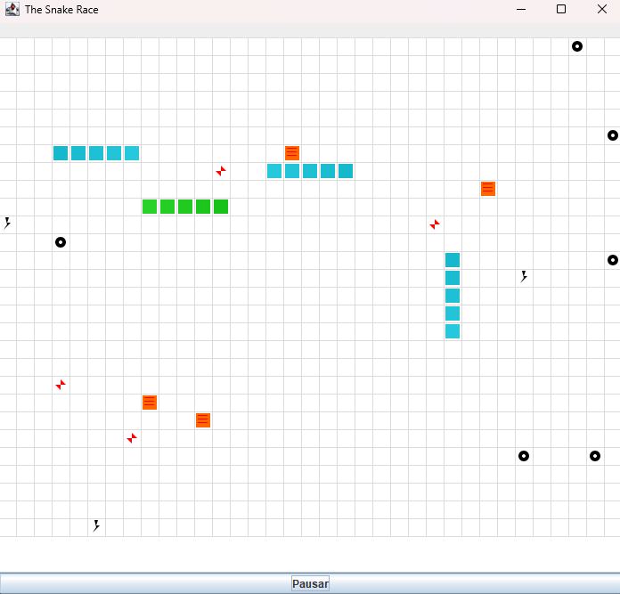
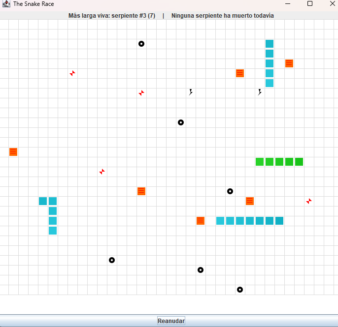
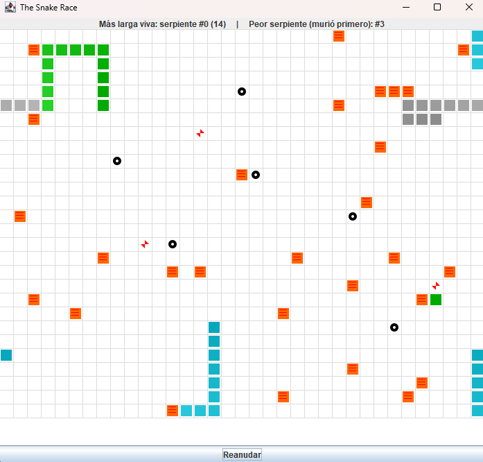

### 4) Robustez bajo carga

- Ejecuta con **N alto** (`-Dsnakes=20` o más) y/o aumenta la velocidad.
- El juego **no debe romperse**: sin `ConcurrentModificationException`, sin lecturas inconsistentes, sin _deadlocks_.
- Si habilitas **teleports** y **turbo**, verifica que las reglas no introduzcan carreras.

> Entregables detallados más abajo.

R/ Se agregó una regla nueva: si una serpiente choca contra su propio cuerpo, muere (se
pinta de gris y deja de moverse). Esta verificación se hizo dentro de la misma zona
protegida que ya existía en el tablero, sin necesidad de bloquear a las demás serpientes,
ya que cada una solo revisa su propio cuerpo. Se probó con 20 serpientes a la vez
 sin que el programa se rompiera ni arrojara errores.

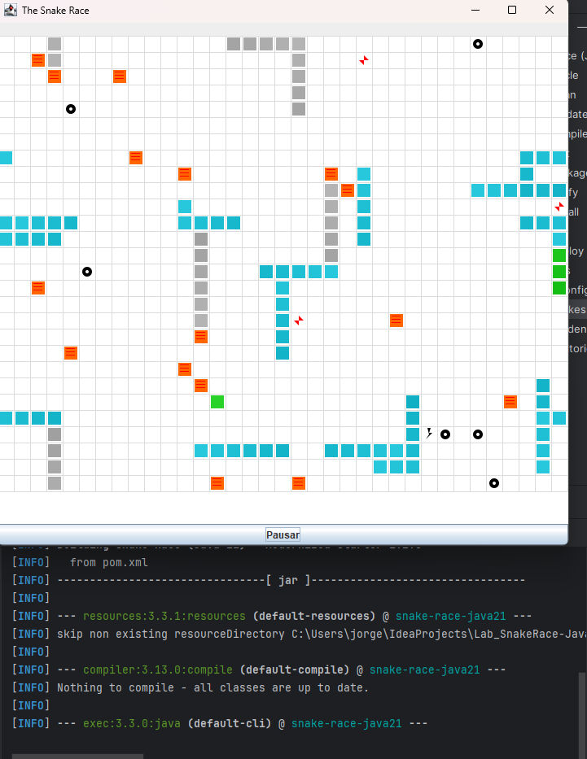

---

## Build

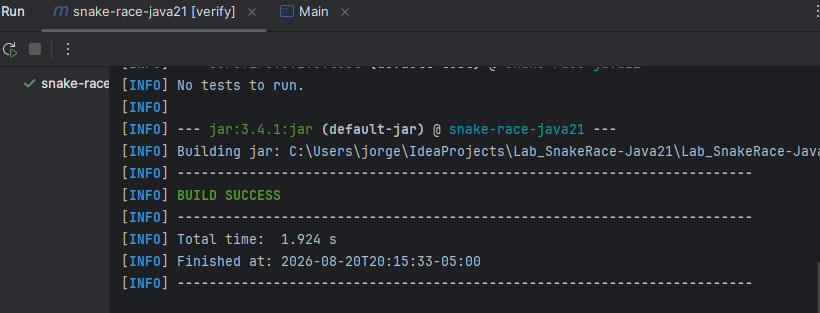

---

## Entregables

1. **Código fuente** funcionando en **Java 21**.
2. Todo de manera clara en **`**el reporte de laboratorio**`** con:
   - Data races encontradas y su solución.
   - Colecciones mal usadas y cómo se protegieron (o sustituyeron).
   - Esperas activas eliminadas y mecanismo utilizado.
   - Regiones críticas definidas y justificación de su **alcance mínimo**.
3. UI con **Iniciar / Pausar / Reanudar** y estadísticas solicitadas al pausar.

---

## Criterios de evaluación (10)

- (3) **Concurrencia correcta**: sin data races; sincronización bien localizada.
- (2) **Pausa/Reanudar**: consistencia visual y de estado.
- (2) **Robustez**: corre **con N alto** y sin excepciones de concurrencia.
- (1.5) **Calidad**: estructura clara, nombres, comentarios; sin _code smells_ obvios.
- (1.5) **Documentación**: **`reporte de laboratorio`** claro, reproducible;

---

## Tips y configuración útil

- **Número de serpientes**: `-Dsnakes=N` al ejecutar.
- **Tamaño del tablero**: cambiar el constructor `new Board(width, height)`.
- **Teleports / Turbo**: editar `Board.java` (métodos de inicialización y reglas en `step(...)`).
- **Velocidad**: ajustar `GameClock` (tick) o el `sleep` del `SnakeRunner` (incluye modo turbo).

---

## Cómo correr pruebas

```bash
mvn clean verify
```

Incluye compilación y ejecución de pruebas JUnit. Si tienes análisis estático, ejecútalo en `verify` o `site` según tu `pom.xml`.

---

## Créditos

Este laboratorio es una adaptación modernizada del ejercicio **SnakeRace** de ARSW. El enunciado de actividades se conserva para mantener los objetivos pedagógicos del curso.

**Base construida por el Ing. Javier Toquica.**
